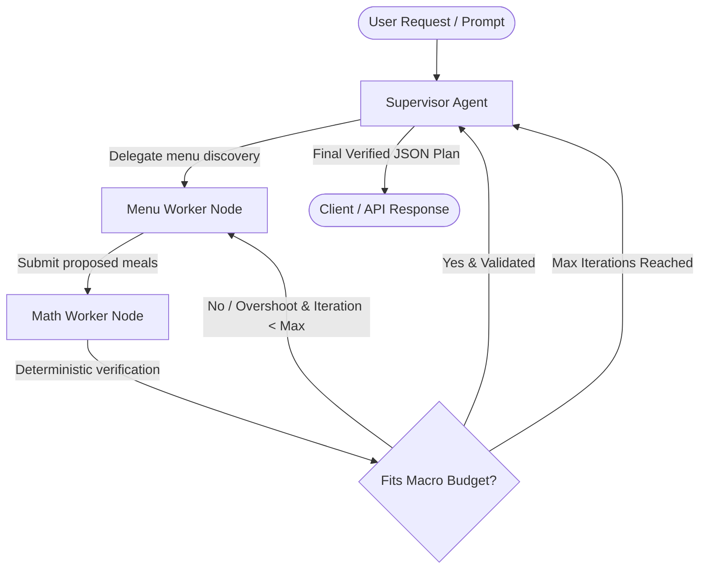

# 🥗 Precision Nutrition & Body Recomposition Orchestrator

An API-first, multi-agent AI system designed to generate **mathematically verified, macro-exact meal plans**. 

Instead of allowing LLMs to hallucinate calorie numbers and portion sizes, this orchestrator uses a **Supervisor-Worker architecture** powered by **LangGraph**, **Pydantic**, and **AWS Bedrock** to strictly verify meals against numerical constraints.

---

## 🏗️ System Architecture



### Agent Roles:
1. **Supervisor Agent**: Understands user intent, calculates remaining macro deficits, delegates to workers, and synthesizes the final verified plan.
2. **Menu Worker**: Queries local restaurant menus (e.g., *Yum Yai Thai*, *Tapari Momo*, *KFC*) with calorie/protein filters and ranks items based on protein density.
3. **Math Worker**: Uses deterministic Python calculation engines to verify if proposed meals fit remaining calorie budgets and protein goals.
4. **Conditional Loopback**: Automatically routes over-budget proposals back to the Menu Worker with exact numerical feedback.

---

## 🛠️ Tech Stack

- **Orchestration**: LangGraph, LangChain Core
- **Data Validation**: Pydantic v2
- **LLM Inference**: AWS Bedrock (Claude 3.5 Sonnet / Llama 3)
- **API Framework (Upcoming Phase 3)**: FastAPI
- **Database**: Local JSON dataset for restaurants & nutritional breakdown
- **Testing**: Python `unittest` suite (19 unit tests)

---

## 📂 Project Structure

```text
nutrition-orchestrator/
├── data/
│   └── mock_menus.json             # Local restaurant menu database with nutritional metrics
├── src/
│   ├── models/
│   │   ├── __init__.py
│   │   └── schemas.py              # Pydantic schemas (UserMacros, MenuItem, MealValidationResult)
│   ├── tools/
│   │   ├── __init__.py
│   │   ├── macro_math.py           # Deterministic deficit & meal evaluation engine
│   │   ├── menu_search.py          # Restaurant menu search & filtering
│   │   └── langchain_tools.py      # LangChain @tool wrappers
│   └── graph/
│       ├── __init__.py
│       ├── state.py                # AgentState TypedDict
│       ├── llm.py                  # AWS Bedrock client & factory
│       ├── nodes.py                # Supervisor, Menu Worker, and Math Worker nodes
│       ├── routing.py              # Conditional routing & error-correction edges
│       └── builder.py              # StateGraph assembly & compilation
├── tests/
│   ├── test_phase1.py              # Unit tests for tools and models
│   └── test_phase2.py              # Unit tests for multi-agent graph execution
├── architecture.md                 # System specification and architecture
├── explanation.md                  # Plain English breakdown of Phase 1
├── demo_graph.py                   # Interactive LangGraph multi-agent demo
├── tool.py                         # Standalone tool demo script
└── requirements.txt
```

---

## 🚀 Getting Started

### 1. Clone the Repository
```bash
git clone https://github.com/<your-username>/nutrition-orchestrator.git
cd nutrition-orchestrator
```

### 2. Set Up Virtual Environment & Dependencies
```bash
python3 -m venv venv
source venv/bin/activate
pip install -r requirements.txt
```

### 3. Run the Automated Test Suite
```bash
python -m unittest discover -s tests -p "test_*.py"
```

### 4. Run the Multi-Agent Demo
```bash
python demo_graph.py
```

---

## 📋 Development Roadmap

- [x] **Phase 1: Deterministic Tools & Models**
  - Pydantic models for strict type validation (`UserMacros`, `MenuItem`, `MealValidationResult`)
  - Mock restaurant database for *Yum Yai Thai*, *Tapari Momo*, and *KFC*
  - `MacroMathEngine` & `LocalMenuSearch` deterministic engines
- [x] **Phase 2: Multi-Agent Engine (LangGraph)**
  - `AgentState` design and LangChain `@tool` wrappers
  - Supervisor, Menu Worker, and Math Worker nodes
  - Conditional loopback edges for calorie/protein self-correction
  - AWS Bedrock LLM client integration
- [ ] **Phase 3: Strict Validation & API Setup**
  - Enforce strict JSON output schemas
  - FastAPI asynchronous endpoints
  - Docker containerization & cloud deployment

---

## 📄 License
MIT License
