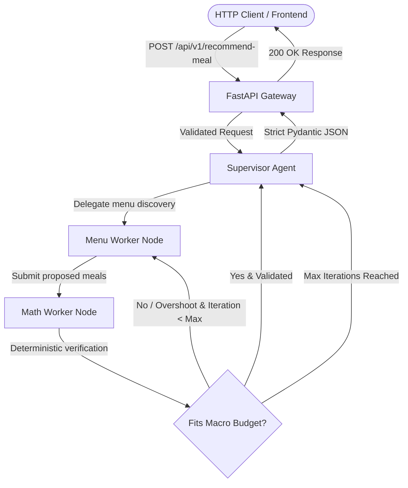

# 🥗 Precision Nutrition & Body Recomposition Orchestrator

An API-first, multi-agent AI system designed to generate **mathematically verified, macro-exact meal plans**. 

Instead of allowing LLMs to hallucinate calorie numbers and portion sizes, this orchestrator uses a **Supervisor-Worker architecture** powered by **LangGraph**, **Pydantic**, **AWS Bedrock**, and **FastAPI** to strictly verify meals against numerical constraints.

---

## 🏗️ System Architecture



### Agent Roles:
1. **Supervisor Agent**: Understands user intent, calculates remaining macro deficits, delegates to workers, and synthesizes the final verified plan.
2. **Menu Worker**: Queries local restaurant menus (e.g., *Yum Yai Thai*, *Tapari Momo*, *KFC*) with calorie/protein filters and ranks items based on protein density.
3. **Math Worker**: Uses deterministic Python calculation engines to verify if proposed meals fit remaining calorie budgets and protein goals.
4. **Conditional Loopback**: Automatically routes over-budget proposals back to the Menu Worker with exact numerical feedback.

---

## 🛠️ Tech Stack

- **API Gateway**: FastAPI, Uvicorn, Starlette Middleware
- **Orchestration**: LangGraph, LangChain Core
- **Data Validation**: Pydantic v2 (Strict Request & Response Models)
- **LLM Inference**: AWS Bedrock (Claude 3.5 Sonnet / Llama 3)
- **Database**: Local JSON dataset for restaurants & nutritional metrics
- **Containerization**: Docker
- **Testing**: Python `unittest` suite (25 unit and integration tests)

---

## 📂 Project Structure

```text
nutrition-orchestrator/
├── data/
│   └── mock_menus.json             # Local restaurant menu database with nutritional metrics
├── src/
│   ├── api/                        # FastAPI Application Gateway
│   │   ├── __init__.py
│   │   ├── main.py                 # FastAPI application, lifespan, routes, CORS
│   │   └── logging_config.py       # Request/Response structured latency logging
│   ├── models/
│   │   ├── __init__.py
│   │   ├── schemas.py              # Core models (UserMacros, MenuItem, MealValidationResult)
│   │   └── api_schemas.py          # Strict HTTP Request & Response models
│   ├── tools/
│   │   ├── __init__.py
│   │   ├── macro_math.py           # Deterministic deficit & meal evaluation engine
│   │   ├── menu_search.py          # Restaurant menu search & filtering
│   │   └── langchain_tools.py      # LangChain @tool wrappers
│   └── graph/
│       ├── __init__.py
│       ├── state.py                # AgentState TypedDict
│       ├── llm.py                  # AWS Bedrock client & factory
│       ├── nodes.py                # Supervisor, Menu Worker, and Math Worker nodes
│       ├── routing.py              # Conditional routing & error-correction edges
│       └── builder.py              # StateGraph assembly & compilation
├── tests/
│   ├── test_phase1.py              # Unit tests for deterministic tools and models
│   ├── test_phase2.py              # Unit tests for multi-agent graph execution
│   └── test_phase3.py              # Integration tests for FastAPI endpoints
├── architecture.md                 # System specification and architecture
├── explanation.md                  # Plain English breakdown of Phase 1
├── demo_graph.py                   # Interactive LangGraph multi-agent demo
├── tool.py                         # Standalone tool demo script
├── Dockerfile                      # Production Docker container definition
└── requirements.txt
```

---

## 🚀 Getting Started

### 1. Clone the Repository
```bash
git clone https://github.com/<your-username>/nutrition-orchestrator.git
cd nutrition-orchestrator
```

### 2. Set Up Virtual Environment & Dependencies
```bash
python3 -m venv venv
source venv/bin/activate
pip install -r requirements.txt
```

### 3. Run the Automated Test Suite (25 Tests)
```bash
python -m unittest discover -s tests -p "test_*.py"
```

### 4. Start the FastAPI Server
```bash
uvicorn src.api.main:app --reload --port 8000
```
Interactive API documentation (Swagger UI) is available at:
👉 **`http://localhost:8000/docs`**

---

## 🌐 API Endpoints & Usage

### 1. Health Check
```bash
curl -s http://localhost:8000/health
```
```json
{
  "status": "healthy",
  "service": "precision-nutrition-orchestrator",
  "version": "1.0.0",
  "timestamp": "2026-09-04T00:34:44.415000+00:00"
}
```

### 2. Browse Local Menus
```bash
# Filter by restaurant
curl -s "http://localhost:8000/api/v1/menu?restaurant=KFC"

# Filter by high protein
curl -s "http://localhost:8000/api/v1/menu?min_protein=35"
```

### 3. Recommend a Precision Meal Plan
```bash
curl -s -X POST http://localhost:8000/api/v1/recommend-meal \
  -H "Content-Type: application/json" \
  -d '{
    "prompt": "I want a high protein dinner from Yum Yai Thai under 1000 calories",
    "target_calories": 2400,
    "target_protein": 155,
    "current_calories": 1400,
    "current_protein": 75,
    "cuisine_preference": "Yum Yai Thai"
  }'
```

**Response:**
```json
{
  "status": "APPROVED",
  "proposed_meals": [
    {
      "restaurant": "Yum Yai Thai",
      "name": "Tom Yum Soup with Prawns",
      "calories": 210,
      "protein_g": 24,
      "price": 14.5
    },
    {
      "restaurant": "Yum Yai Thai",
      "name": "Thai Green Curry with Chicken Breast",
      "calories": 710,
      "protein_g": 42,
      "price": 18.0
    }
  ],
  "nutrition_summary": {
    "total_calories": 920,
    "total_protein_g": 66,
    "remaining_calories_after_meal": 80,
    "remaining_protein_after_meal": 14,
    "fits_calorie_budget": true,
    "meets_protein_target": false
  },
  "feedback": "Calorie budget met: Proposed meal total is 920 kcal (under/equal to remaining 1000 kcal budget, 80 kcal buffer remaining).",
  "iterations_used": 1,
  "execution_time_ms": 6.42
}
```

---

## 🐳 Docker Deployment

### Build the Image
```bash
docker build -t nutrition-orchestrator:latest .
```

### Run the Container
```bash
docker run -p 8000:8000 nutrition-orchestrator:latest
```

---

## 📋 Development Roadmap

- [x] **Phase 1: Deterministic Tools & Models**
  - Pydantic models for strict type validation (`UserMacros`, `MenuItem`, `MealValidationResult`)
  - Mock restaurant database for *Yum Yai Thai*, *Tapari Momo*, and *KFC*
  - `MacroMathEngine` & `LocalMenuSearch` deterministic engines
- [x] **Phase 2: Multi-Agent Engine (LangGraph)**
  - `AgentState` design and LangChain `@tool` wrappers
  - Supervisor, Menu Worker, and Math Worker nodes
  - Conditional loopback edges for calorie/protein self-correction
  - AWS Bedrock LLM client integration
- [x] **Phase 3: Strict Validation & API Setup**
  - Strict Pydantic HTTP schemas (`MealRecommendationRequest`, `MealRecommendationResponse`)
  - FastAPI asynchronous gateway with CORS & structured request logging
  - Integration test suite for HTTP status codes and schema validation
  - Docker containerization for production deployment

---

## 📄 License
MIT License
